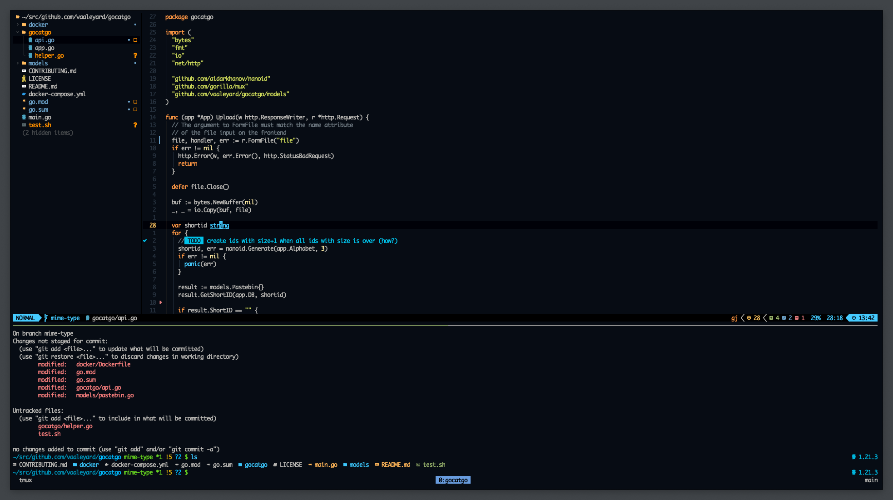

<p align="center">
    
    <p align="center"> my custom config for terminals, editors, git, etc. </p>
</p>

---

 <br />

## Setup
Managed with [`chezmoi`](https://github.com/twpayne/chezmoi).

```
chezmoi init vaaleyard
```

## Info

- Distro: `macOS`
- Terminal Emulator: `Ghostty`
- Editor: `NeoVim`
- Font: `BlexMono Nerd Font`

---

Interesting read:
* [Why share your dotfiles](https://zachholman.com/2010/08/dotfiles-are-meant-to-be-forked/)
* [Rob Pike: “Dotfiles” being hidden is a UNIXv2 mistake (2012)](https://web.archive.org/web/20180827160401/https://plus.google.com/+RobPikeTheHuman/posts/R58WgWwN9jp)
